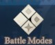
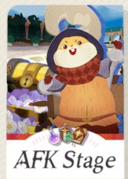
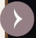
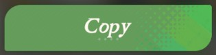
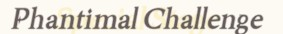
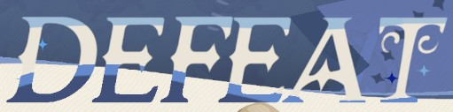
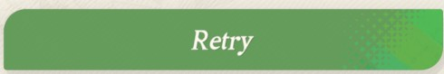

# Guía de Plantillas Visuales (AFK Journey)

Este documento contiene la lista de imágenes requeridas por el bot para el reconocimiento de la interfaz del juego. Si compartes el bot con un amigo, esta tabla le servirá de referencia visual para saber qué capturar y cómo nombrar cada archivo.

Todas las capturas deben guardarse en la carpeta: `c:\Users\rubbe\Documents\AFK_stages\images\`

---

## 1. Navegación de Menús e Inicio

| Vista Previa | Nombre de Archivo | Descripción del Botón / Pantalla |
| :---: | :--- | :--- |
|  | `battle_modes.jpg` | Botón en la interfaz principal del lobby para abrir el menú de modos de batalla. |
|  | `AFK_stages.jpg` | Botón en el menú de modos de batalla que da acceso a las etapas AFK. |
|  | `normal_challenge.jpg` | Botón para iniciar el desafío en modo normal (Batalla AFK). |
|  | `phantimal_challenge.jpg` | Botón para iniciar el desafío en el modo Phantimal Challenge. |
|  | `atras.jpg` | Botón de retroceso (esquina superior izquierda) para salir de preparación o del mapa de etapas. |

---

## 2. Preparación de Combate y Selección de Equipos

| Vista Previa | Nombre de Archivo | Descripción del Botón / Pantalla |
| :---: | :--- | :--- |
|  | `records.jpg` | Botón de registros de comunidad en la pantalla de preparación (icono de gráfico o lista). |
|  | `next_formation.jpg` | Flecha derecha en el menú de récords para pasar al siguiente equipo exitoso de la lista. |
|  | `copy.jpg` | Botón para copiar/aplicar la formación de héroes seleccionada actualmente en el panel. |
|  | `battle.jpg` | Botón verde grande de iniciar combate que se pulsa tras aplicar la formación. |

---

## 3. Fin de la Batalla (Victoria / Derrota)

| Vista Previa | Nombre de Archivo | Descripción del Botón / Pantalla |
| :---: | :--- | :--- |
|  | `victory.jpg` | Cartel o pantalla de Victoria que aparece al superar la etapa. |
|  | `continuar_normal.jpg` | Botón para avanzar directamente al siguiente nivel tras ganar en el modo Normal. |
|  | `continuar_phantimal.jpg` | Botón para avanzar directamente al siguiente nivel tras ganar en el modo Phantimal. |
|  | `defeat.jpg` | Cartel o pantalla de Derrota que aparece al perder el combate. |
|  | `retry.jpg` | Botón para regresar a la pantalla de preparación tras una derrota. |

---

## 4. Notas de Visión Artificial

> [!WARNING]
> **Similitud de Botones:** Los botones `normal_challenge.jpg`, `continuar_normal.jpg` y `battle.jpg` contienen textos similares sobre fondo verde. El bot los distingue gracias a que solo los busca en fases lógicas diferentes de la máquina de estados.
